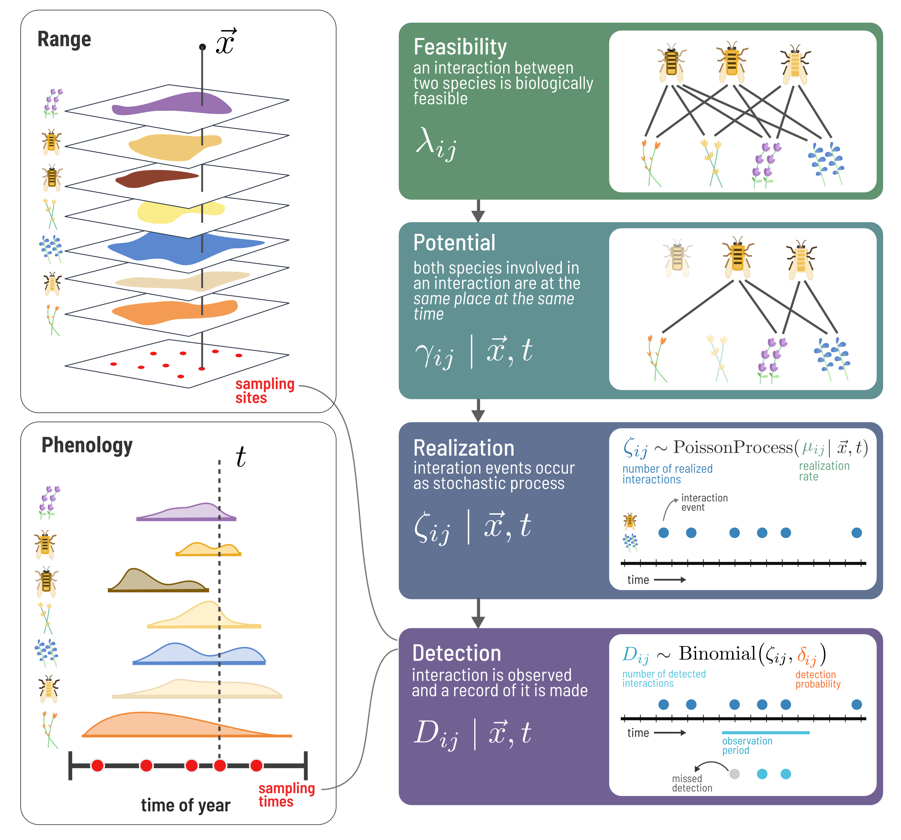

# SpeciesInteractionSamplers.jl

[](https://gottacatchenall.github.io/SpeciesInteractionSamplers.jl)


A Julia package for simulating the sampling of species interaction networks with spatiotemporal variation.



## Overview

Species interaction networks are sampled imperfectly. The species and interactions we observe depend on where and when we sample, how abundant species are, and how detectable interactions are. **SpeciesInteractionSamplers.jl** provides a simulation framework for modeling this sampling process.


The package implements a four-stage pipeline that mirrors how field sampling works:

| Stage | Description | Function |
|-------|-------------|----------|
| **Feasible** | All biologically possible interactions (the metaweb) | `generate()` |
| **Potential** | Interactions possible given spatiotemporal co-occurrence | `possibility()` |
| **Realized** | Interactions that actually occur (stochastic, abundance-dependent) | `realize()` |
| **Detected** | Interactions that are observed by the sampling method | `detect()` |


## Quick Start

The package can be installed via:

```julia
using Pkg
Pkg.add("SpeciesInteractionSamplers")
```

```@setup 1
using SpeciesInteractionSamplers
```

The equivalent of "Hello, World" in SpeciesInteractionSamplers.jl is the following lines to simulate the process of sampling a food-web.   

```julia
using SpeciesInteractionSamplers

# 1. Define a species pool and generate a metaweb
pool = UnipartiteSpeciesPool(30)
metaweb = generate(NicheModel(0.15), pool)

# 2. Generate species abundances
abundances = generate(LogNormalAbundance(), pool)

# 3. Realize interactions (abundance-dependent encounter)
realized = realize(metaweb, MassActionRealization(abundances; energy=500))

# 4. Detect interactions (imperfect observation)
detected = detect(realized, AbundanceScaledDetection(abundances))
```

For more detailed tutorials, how-tos, and reference on functions, see the [documentation](https://gottacatchenall.github.io/SpeciesInteractionSamplers.jl).