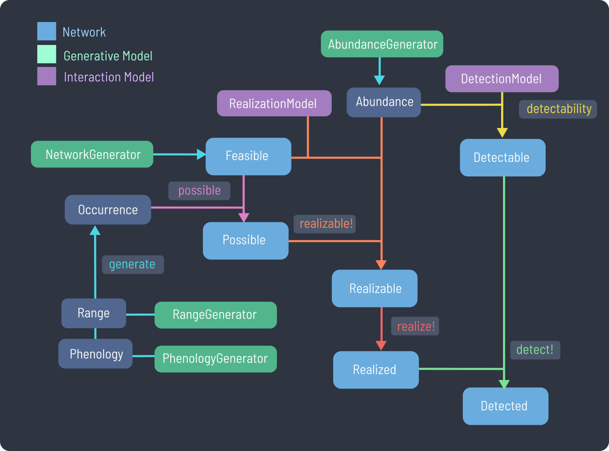

# SpeciesInteractionSamplers.jl {#SpeciesInteractionSamplers.jl}

Documentation for `SpeciesInteractionSamplers.jl`.





```julia
feasible_network = generate(NicheModel())
relative_abundance = generate(NormalizedLogNormal(σ=0.2), feasible_network)

energy = 500
realization_rate = realizable!(NeutrallyForbiddenLinks(energy), feasible_network, relative_abundance)
realized_network = realize!(feasible_network)

detectability_network = detectability(RelativeAbundanceScaled(10.0),feasible_network, relative_abundance)
detected_network = detect!(feasible_network, detectability_network)
```


```ansi
Detected Global Metaweb
```

