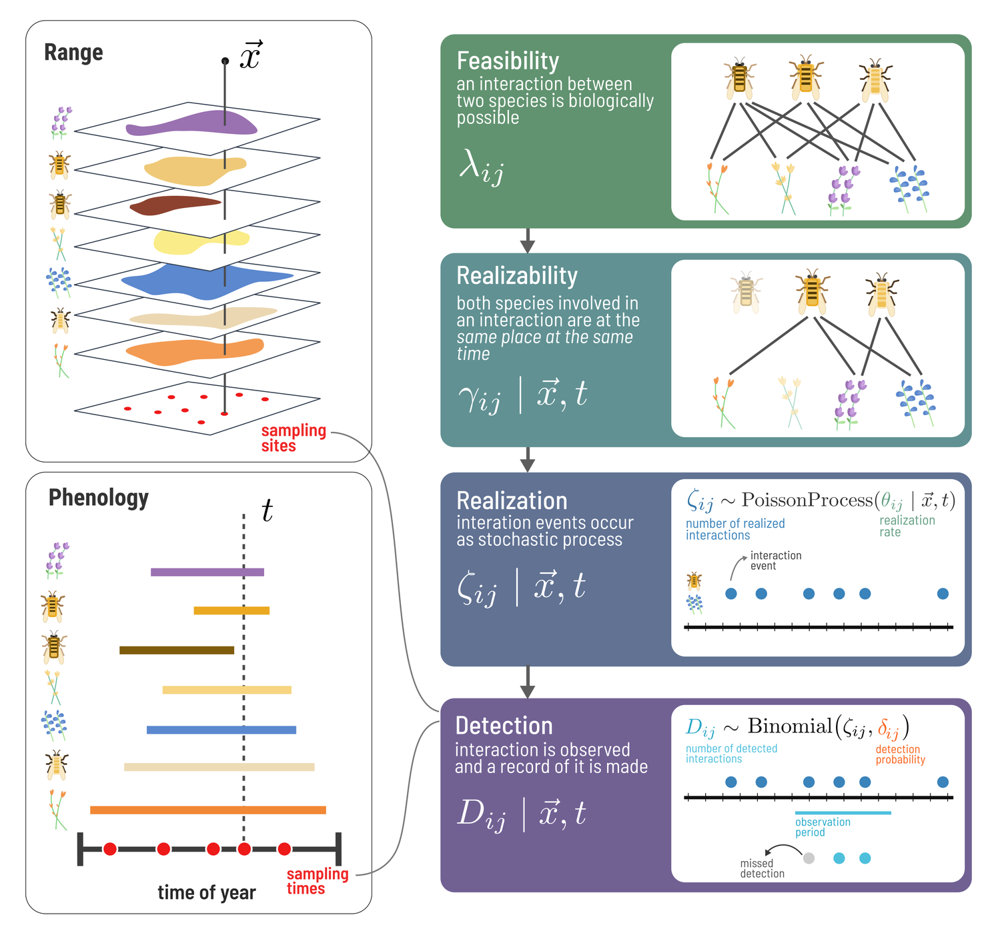
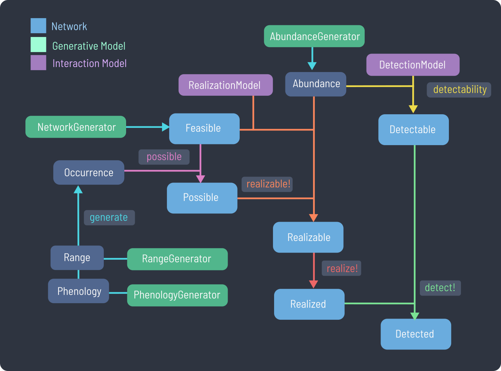

# SpeciesInteractionSamplers.jl

Documentation for `SpeciesInteractionSamplers.jl`.





```@setup 1
using SpeciesInteractionSamplers
```

```@example 1
feasible_network = generate(NicheModel())
relative_abundance = generate(NormalizedLogNormal(σ=0.2), λ)

energy = 500
realization_rate = realizable(feasible_network, NeutrallyForbiddenLinks(energy), relative_abundance)
realized_network = realize(θ)

detectability_network = detectability(λ, RelativeAbundanceScaled(10.0), relative_abundance)
detected_network = detect(ζ, δ)
```
